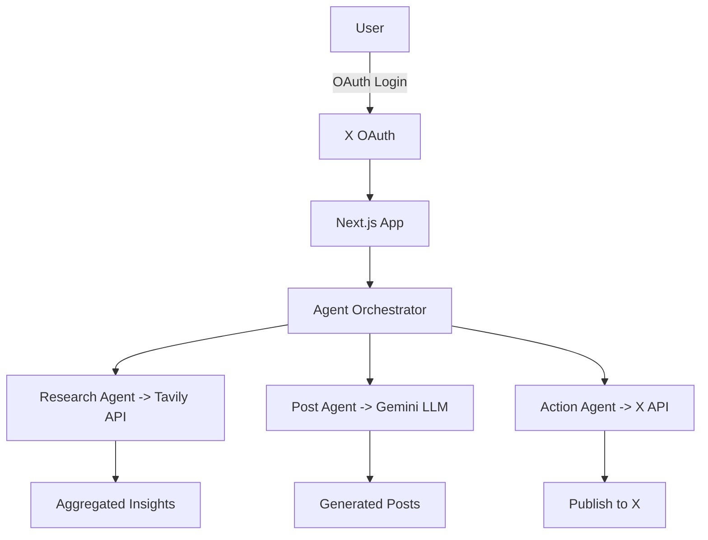

# 🧠 X Research Agent  

An **AI-powered research and posting agent** built on top of **X OAuth + Generative AI**, designed to automate research, content generation, and publishing workflows.  

This project combines **Gemini, Tavily, and custom AI agents** (Action Agent, Post Agent, Research Agent) to help users **research topics, generate insights, and post directly on X (Twitter)** in a fully automated pipeline.  

---

## ✨ Features  
- 🔑 **X OAuth Integration** – Secure login & tokenized access to user accounts.  
- 🤖 **AI Agents** – Modular agents for different workflows:  
  - **Research Agent**: Collects insights from Tavily + Gemini.  
  - **Post Agent**: Crafts engaging X posts with context-aware formatting.  
  - **Action Agent**: Handles scheduling, replies, and follow-up actions.  
- 🧩 **GenAI Pipeline** – Uses Gemini LLM for reasoning and Tavily for real-time data.  
- 📊 **Customizable Prompts** – Easily adapt tone, style, and research depth.  
- 🌐 **Next.js Frontend** – Clean UI for agent management & execution logs.  

---

## 🏗️ Architecture Overview  


---

## 🛠️ Tech Stack  
- **Frontend**: Next.js + Tailwind  
- **Backend**: TypeScript (API Routes / Server Actions)  
- **AI/LLMs**: Gemini (content generation)  
- **Research API**: Tavily (real-time web/data insights)  
- **Auth & Posting**: X OAuth + X API  

---

## ⚙️ Installation & Setup  
```bash
# Clone repo
git clone https://github.com/username/x-research-agent.git
cd x-research-agent

# Install dependencies
npm install

# Setup environment
cp .env.example .env
# Add your X OAuth keys, Tavily API key, Gemini API key

# Run locally
npm run dev
```

---

## 📦 Example Workflow  
1. 🔑 User logs in with **X OAuth**  
2. 🔎 Research Agent queries Tavily for data  
3. 🧠 Gemini processes insights → generates summary  
4. ✍️ Post Agent formats content into X-ready posts  
5. 🚀 Action Agent publishes or schedules to X  

---

## 📈 Roadmap  
- [ ] Multi-account support  
- [ ] Advanced post scheduling + thread generation  
- [ ] Sentiment & engagement analysis  
- [ ] Plugin system for new AI agents  

---

## 🤝 Contributing  
1. Fork this repo  
2. Create a new branch (`feature/your-feature`)  
3. Commit & push changes  
4. Open a PR  
